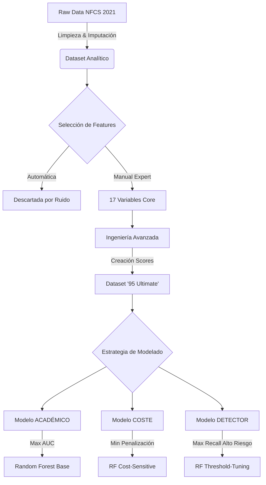
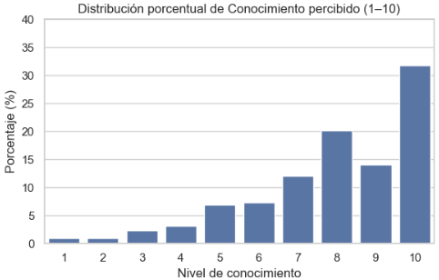
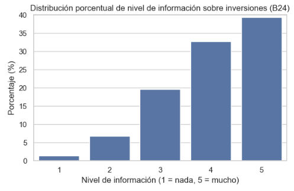
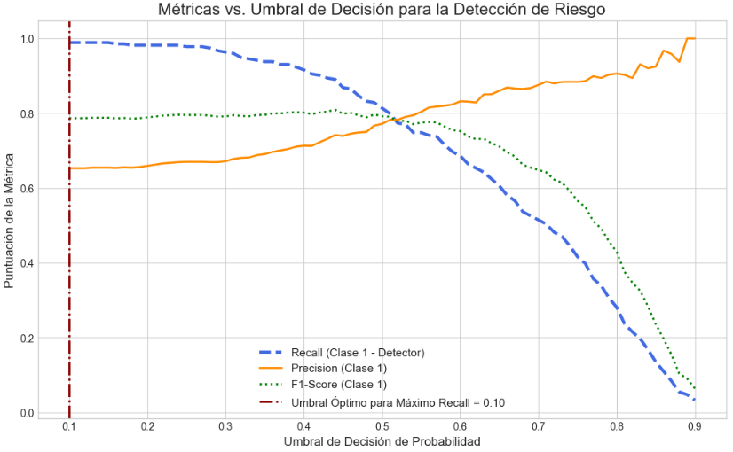
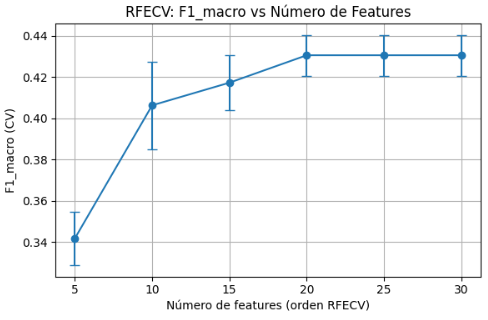
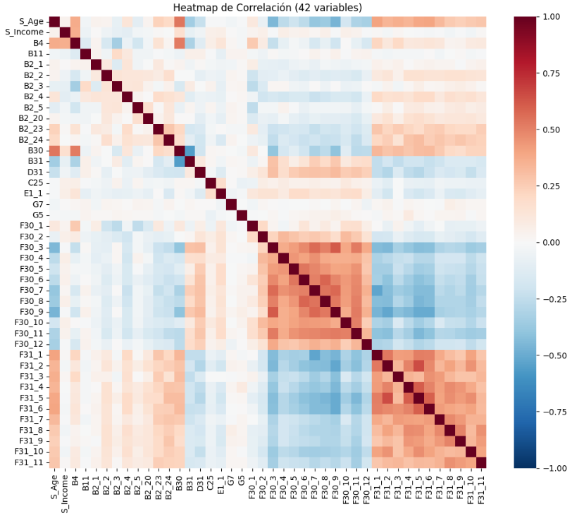

# 🎯 Perfilación Avanzada de Riesgo del Inversor


> **Trabajo Fin de Máster (TFM) - Data Science** > **Autor:** Antonio Esquinas  
> **Convocatoria:** 2024/2025

---

## 💼 Resumen Ejecutivo

Este proyecto moderniza la clasificación de inversores (MIFID) utilizando Machine Learning sobre datos conductuales reales (*NFCS 2021*). 

He resuelto el problema del **desbalanceo extremo** (pocos perfiles arriesgados) mediante una estrategia de ingeniería de características y optimización de umbrales. El resultado no es un único modelo, sino una **suite de 3 soluciones** adaptadas a distintas necesidades de negocio:

| Modelo | Objetivo (KPI) | Caso de Uso Ideal |
| :--- | :--- | :--- |
| **🎓 Académico** | Max **AUC / F1-Macro** | Investigación / Benchmarking |
| **💰 Coste** | Min **Coste Económico** | Robo-Advisors / Banca Comercial |
| **🛡️ Detector** | Max **Recall (Alto Riesgo)** | Compliance / Regulación |

**Impacto del Proyecto:**
* **Datos:** Curación de un dataset real de +2.800 inversores con 95+ variables.
* **Ingeniería:** Creación del dataset *"95 Ultimate"*, enriquecido con scores psicométricos y gaps de percepción.
* **Resultados:** Capacidad de detectar perfiles de Alto Riesgo con un **Recall > 80%** (Modelo Detector) o maximizar la eficiencia global con un **AUC > 0.82** (Modelo Académico).

---

## 🗺️ Flujo de Trabajo y Metodología

El ciclo de vida del dato ha seguido una estructura rigurosa, desde la ingestión hasta la optimización de costes.


---

## 🔬 Deep Dive: Anatomía Técnica del Proyecto

Este proyecto analiza el riesgo del inversor desde cuatro dimensiones, buscando que el modelo sea transparente y útil en el mundo real, no una "caja negra" difícil de entender.

---

### 1. Dimensión Comportamental (Psicología Financiera)

Ingeniería de datos para capturar cómo piensa y actúa el inversor.

**Disonancia entre lo que se dice y lo que se hace**  
Disonancia entre lo que se dice y lo que se hace Los cuestionarios tradicionales fallan porque se basan solo en la palabra del usuario. Se han creado variables nuevas (05.1) que detectan contradicciones; por ejemplo, usuarios que dicen ser "conservadores" pero tienen gran parte de su cartera en activos muy volátiles como Cripto.

<p align="center">


<em><strong>Fig 1. El sesgo de sobreconfianza:</strong> Nótese la disparidad entre el conocimiento financiero que el usuario cree tener (izquierda) y los resultados obtenidos en el quiz técnico real (derecha).</em>
</p>

**El peligro del "Nativo Digital"**  
Mediante análisis de grupos (*K-Means*), se identificó un perfil de usuario con mucha habilidad tecnológica pero poco conocimiento financiero real.  
El modelo se ha ajustado para detectar este exceso de confianza y evitar que estos usuarios asuman riesgos que no comprenden.

---

### 2. Dimensión Estratégica (Negocio y Seguridad)

Ajuste del modelo para cumplir con la normativa financiera.

**Ajuste de Umbrales (Más allá del 50%)**  
Ajuste del modelo para cumplir con la normativa financiera.

Ajuste de Umbrales (Más allá del 50%) Un modelo estándar divide las decisiones a la mitad (0.5), pero en finanzas eso es arriesgado. Se movió el punto de decisión a 0.42 – 0.47 (Notebook 04.3) para que el sistema sea más sensible al riesgo.

Resultado: Este cambio permitió pasar de detectar el 56% de los perfiles peligrosos a 81%, haciendo que el modelo sea mucho más seguro.

<p align="center">


<em><strong>Fig 2. Optimización del Punto de Corte:</strong> Análisis de sensibilidad donde se prioriza el Recall de la clase crítica (Alto Riesgo) para cumplir con el marco regulatorio MiFID II.</em>
</p>


**El Escudo ante el Regulador**  
Se priorizó detectar a los perfiles vulnerables por encima de la exactitud general.  
Es más seguro avisar de más a un cliente conservador que cometer el error de clasificar como *"arriesgado"* a alguien que no puede permitirse perder su dinero.

---

### 3. Dimensión Metodológica (Criterio Experto vs. Automático)

Por qué el conocimiento financiero vence a la fuerza bruta.

**El límite de la automatización**  
Dejar que el ordenador cree variables automáticamente tiene un límite de rendimiento. Las herramientas automáticas se estancaron al no entender el significado real de las preguntas financieras.

<p align="center">


<em><strong>Fig 3. Techo del RFECV:</strong> La selección automática de características muestra un estancamiento (plateau) en el rendimiento, demostrando que añadir más variables sin criterio clínico no aporta valor.</em>
</p>

**Ingeniería de Datos Manual**  
El éxito del proyecto vino de crear variables a mano (*95_Ultimate*) basadas en lógica financiera.  
Estas variables "artesanales" fueron las únicas capaces de romper la barrera de rendimiento del modelo, garantizando además que cada decisión pueda ser explicada a un regulador.

<p align="center">


<em><strong>Fig 4. Matriz de Interacciones:</strong> Mapa de calor de las variables seleccionadas por dominio, eliminando ruido y multicolinealidad para asegurar la interpretabilidad del modelo.</em>
</p>

---

### 4. Dimensión Algorítmica (Elección del Modelo)

Comparativa de algoritmos para encontrar el equilibrio ideal.

**Torneo de Modelos**  
Se compararon:
- Regresión Logística  
- Random Forest  
- LightGBM  

Aunque Random Forest es muy visual, **LightGBM (04.3)** resultó ser el ganador:  
- Mayor velocidad  
- Mejor puntuación (**AUC ≈ 0.82**)  
- Más adecuado para una aplicación real con respuestas en tiempo real  

---

## Estructura del Repositorio

El código está organizado secuencialmente para facilitar su auditoría.

### Fase 1: Exploración y Limpieza
- `0_NFCS_2021_EDA.ipynb` → EDA inicial y decisión de fuente de datos  
- `01_NFCS_2021_Full_EDA.ipynb` → Análisis profundo de variables  
- `02_NFCS_Data_Cleaning.ipynb` → Tratamiento de *missings* y *outliers*

### Fase 2: Selección y Estrategia
- `03.1_Division_TrainValTest.ipynb` → *Splits* estratificados  
- `03.3_Seleccion_Features_Manual.ipynb` → Selección por dominio (ganadora frente a automática)  
- `03.5_Modelo_2outputs.ipynb` → Decisión crítica (*Binario vs Multiclase*)

### Fase 3: Modelado Base
- `04.1` a `04.3` → Benchmarking de algoritmos:
  - Logistic Regression  
  - Random Forest  
  - LightGBM  

**Insight:** LightGBM ofreció la mejor relación rapidez/rendimiento (**AUC ≈ 0.82**).

### Fase 4: Optimización Final (Producción)
- `05.1_Ingenieria_Avanzada_95.ipynb` → Creación del dataset final  
- `06.0_Modelado_Comparacion.ipynb` → Torneo de modelos  
- `06.1 / 06.2 / 06.3` → Ajuste fino de hiperparámetros y umbrales para los 3 modelos finales  

---

## 💻 Instrucciones de Instalación

El proyecto es totalmente reproducible.  
Sigue estos pasos:

### Clonar repositorio

```bash
git clone https://github.com/AntonioE/TFM-Digitech.git
cd TFM-Digitech
```

### Entorno Virtual (Recomendado):

```bash
python -m venv venv_tfm
source venv_tfm/bin/activate  # En Windows: venv_tfm\Scripts\activate
pip install -r requirements.txt
```

### Ejecución:
Lanza Jupyter Lab y navega a la carpeta notebooks/.

```bash
jupyter lab
```
Nota: El archivo config.py gestiona las rutas automáticamente, ya sea en Local o Google Colab.

